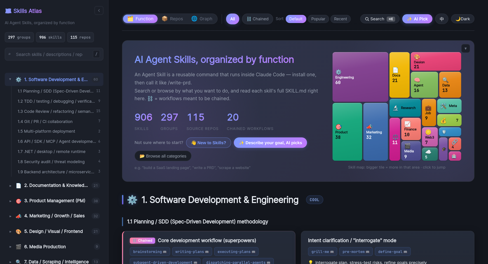

**English** | [中文](README.zh-CN.md)

<div align="center">

# 🗺️ Skills Atlas

**The right ready-made skill for any task in Claude Code — found, installed, and surfaced as you work.**

900+ skills, gathered from across the ecosystem and organized by what they do.

[](data/skills.yaml)
[](data/repositories.yaml)
[](data/categories.yaml)
[](https://www.npmjs.com/package/skills-atlas-cli)
[](LICENSE)

[**🧩 Claude Code plugin**](packages/skills-atlas-cli/plugin) | [**⌨️ CLI**](packages/skills-atlas-cli) | [🌐 Visit online](https://zita-go.github.io/Skills-Atlas/?lang=en) | [📦 Data download](data/) | [🤝 Contribute a new skill](CONTRIBUTING.md) | [💬 Discussions](../../discussions)

<a href="https://zita-go.github.io/Skills-Atlas/?lang=en"></a>

</div>

---

## Why

Agent skills exploded in 2025 — but they're scattered across ~118 GitHub repos, and awesome-lists
only give you names, never which ones actually **work together**. Skills Atlas gathers them and
organizes everything **by function**, so you find a skill by the job at hand: the SEO skills from
different repos side by side, the dev-workflow skills marked **must-chain** (⛓ — grab the whole set with `--chain`), the document suite
at a glance. **319 functional groups across 20 categories** — software, PM, marketing and design,
plus the pro verticals (legal, healthcare, finance, DevOps, security, …) — searchable
[online](https://zita-go.github.io/Skills-Atlas/?lang=en) or from your shell.

## Quick start

Use it as a **Claude Code plugin** — discover, install, and *grow* skills inside the conversation,
with the autopilot on by default.

**1. In your terminal** — install the engine (Node 18+):

```bash
npm i -g skills-atlas-cli
```

**2. In Claude Code** — add the plugin:

```text
/plugin marketplace add Zita-Go/Skills-Atlas
/plugin install skills-atlas@skills-atlas
```

Restart Claude Code, then just describe what you're doing — the autopilot takes it from there. Run
`/skills-atlas:setup` to see what you've got, or skip to [**How to use**](#how-to-use).

## 🤖 The autopilot: the right skill finds you

You shouldn't have to remember a skill exists to use it. With the plugin the autopilot is **on by
default**: whenever your task lines up with a skill you don't have, Claude surfaces it — explains
what it does and why it fits — and lets you switch it on, see what it covers, or skip.

<a href="packages/skills-atlas-cli/plugin"></a>

The per-prompt match runs **locally** and **never auto-installs**; a hiccup never blocks your
prompt. Toggle or tune it with `/skills-atlas:skill-autopilot [on|off]` — or, CLI-only (no plugin), `skills-atlas hook on`. Two more proactive helpers,
same idea:

- **🔭 `/skills-atlas:skill-gaps`** — spots recurring work no installed skill covers, and recommends one.
- **🧹 `/skills-atlas:skill-prune`** — offers to clear out skills you've stopped using.

## How to use

Already set up? Here's the reference.

> [!NOTE]
> **Where a skill lands:** installed for **this project** it goes to `./.claude/skills/` (committable — it travels with the repo); a **global** one goes to `~/.claude/skills/` (follows you everywhere). The plugin, autopilot and `kit` default to the project; the CLI's `install` / `use` default to global. Override either with `--project` / `--global`.

### In Claude Code — the plugin

Just describe what you need, or reach for a command:

| Command | What it does |
|---|---|
| `/skills-atlas:skill-search <query>` | Find a skill in the catalog |
| `/skills-atlas:skill-install <skill>` | Install + activate it in this project |
| `/skills-atlas:skill-kit` | Detect the project type and set up a curated kit |
| `/skills-atlas:skill-craft` | Turn a workflow you keep repeating into a new skill |
| `/skills-atlas:skill-gaps` | Recommend skills for the work you keep doing |
| `/skills-atlas:skill-prune` | Flag installed skills you no longer use |
| `/skills-atlas:skill-autopilot [on\|off]` | Toggle / tune the autopilot |

→ [**full plugin docs**](packages/skills-atlas-cli/plugin)

### From the terminal — the CLI

<a href="packages/skills-atlas-cli"></a>

The same engine, for the shell. Install once (`npm i -g skills-atlas-cli`), then:

```bash
skills-atlas search seo               # find a skill (ranked by relevance + stars)
skills-atlas info brainstorming       # what it does + when to use it
skills-atlas install brainstorming    # drop its folder into ~/.claude/skills/ (global by default)
skills-atlas use brainstorming        # install + apply now, no restart
skills-atlas kit                      # detect this project, install a tailored set
```

> [!TIP]
> No global install? Prefix any command with `npx skills-atlas-cli …`.

Beyond that, the CLI is a full package manager (`installed`, `outdated`, `upgrade`, `remove`, `doctor`),
reproduces a project's skill set from a committable `skills-atlas.kit.json` (`sync`), merges your org's
private catalog (`registry add` — a private skill wins a name clash), and runs as an MCP server for any client.
→ [**full CLI docs**](packages/skills-atlas-cli)

## Contributing

New skills, fixes, better descriptions, translations — all welcome. See **[CONTRIBUTING.md](CONTRIBUTING.md)**.

## Related projects / inspiration

This project's skill data is sourced from the excellent repositories below (top contributors only; full list in `data/repositories.yaml`):

- [obra/superpowers](https://github.com/obra/superpowers) — Claude Code software-development methodology
- [phuryn/pm-skills](https://github.com/phuryn/pm-skills) — 65 PM skills
- [openai/skills](https://github.com/openai/skills) — OpenAI Codex 41 skills
- [anthropics/skills](https://github.com/anthropics/skills) — Anthropic 17 skills
- [coreyhaines31/marketingskills](https://github.com/coreyhaines31/marketingskills) — 41 marketing skills
- [deanpeters/Product-Manager-Skills](https://github.com/deanpeters/Product-Manager-Skills) — 47 PM skills
- [muratcankoylan/Agent-Skills-for-Context-Engineering](https://github.com/muratcankoylan/Agent-Skills-for-Context-Engineering) — 15 Context Engineering skills

## License

[MIT](LICENSE) — use, modify, and commercialize freely, with attribution.

> The skill metadata / descriptions here are curated by us; each skill's actual `SKILL.md` lives in its origin repo (see `data/repositories.yaml`), under its own license.

## Maintainers

Maintained collectively by the community. This project grew out of an internal documentation-organization effort; all skill authors are welcome to PR improvements to their own repository's description.
