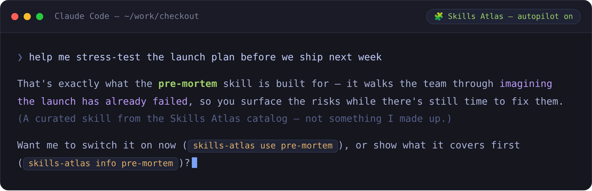
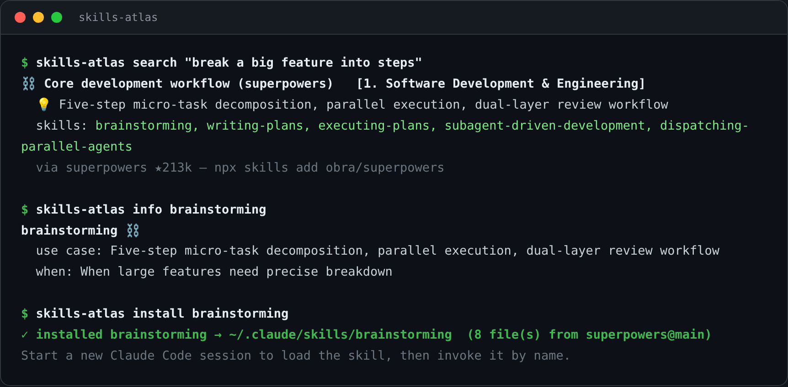

[English](README.md) | **中文**

<div align="center">

# 🗺️ Skills Atlas

**在 Claude Code 里，任何任务都能拿到对的那个现成 skill —— 自动找到、装好，还在你干活时主动端到面前。**

900+ 个 skill，从整个生态里收集、按"做什么"重新组织。

[](data/skills.yaml)
[](data/repositories.yaml)
[](data/categories.yaml)
[](https://www.npmjs.com/package/skills-atlas-cli)
[](LICENSE)

[**🧩 Claude Code 插件**](packages/skills-atlas-cli/plugin) | [**⌨️ CLI**](packages/skills-atlas-cli) | [🌐 在线访问](https://zita-go.github.io/Skills-Atlas/?lang=zh) | [📦 数据下载](data/) | [🤝 贡献新 skill](CONTRIBUTING.zh-CN.md) | [💬 讨论区](../../discussions)

<a href="https://zita-go.github.io/Skills-Atlas/?lang=zh"></a>

</div>

---

## 为什么

Agent skills 在 2025 年爆发 —— 但它们散落在 ~115 个 GitHub 仓库里，而 awesome 列表只给你名字，从不告诉你**哪几个能配合用**。Skills Atlas 把它们收集起来、统一**按功能**组织，让你按手头的活去找：不同仓库的 SEO skill 并排摆出来、必须串起来用的开发工作流标成 **must-chain（⛓ —— 用 `--chain` 一次装齐）**、文档处理套件一目了然。**297 个功能分组、覆盖 20 个大类** —— 软件、产品、营销、设计，加上法律、医疗、金融、DevOps、安全等专业垂直领域 —— 在[网站](https://zita-go.github.io/Skills-Atlas/?lang=zh)上或终端里都能搜。

## 快速上手

把它当 **Claude Code 插件**用 —— 在对话里发现、安装、甚至**孵化** skill，自动驾驶默认开启。

**① 在终端** —— 装引擎（Node 18+）：

```bash
npm i -g skills-atlas-cli
```

**② 在 Claude Code 里** —— 加插件：

```text
/plugin marketplace add Zita-Go/Skills-Atlas
/plugin install skills-atlas@skills-atlas
```

重启 Claude Code，然后直接说你要做什么 —— 剩下交给自动驾驶。随时 `/skills-atlas:setup` 看你装了什么，或直接跳到 [**怎么用**](#怎么用)。

## 🤖 自动驾驶：让对的 skill 主动找你

你不该为了用上一个 skill，得先记得它存在。用插件的话，自动驾驶**默认开启**：只要你的任务命中某个你还没装的 skill，Claude 就主动端出来 —— 讲清楚它干嘛、为什么合适 —— 再让你现在就开、先看它覆盖什么、或者跳过。

<a href="packages/skills-atlas-cli/plugin"></a>

逐条匹配在**本地**完成、**绝不自动安装**，出岔子也不会卡住你的 prompt。用 `/skills-atlas:skill-autopilot [on|off]` 开关或微调（只用 CLI、没插件的话用 `skills-atlas hook on`）。还有两个同样主动的帮手：

- **🔭 `/skills-atlas:skill-gaps`** —— 发现你反复在做、却没 skill 覆盖的那类活，并推荐一个。
- **🧹 `/skills-atlas:skill-prune`** —— 把你已装但用不上的 skill 挑出来。

## 怎么用

已经装好了？这里是参考。

> [!NOTE]
> **skill 装到哪儿：** 装到**本项目**的在 `./.claude/skills/`（可提交 —— 跟着仓库走）；**全局**的在 `~/.claude/skills/`（走到哪跟到哪）。插件、自动驾驶和 `kit` 默认装到项目；CLI 的 `install` / `use` 默认装到全局。两边都能用 `--project` / `--global` 覆盖。

### 在 Claude Code 里 —— 插件

直接说你要什么，或用命令：

| 命令 | 作用 |
|---|---|
| `/skills-atlas:skill-search <query>` | 在目录里找 skill |
| `/skills-atlas:skill-install <skill>` | 装上并在本项目激活 |
| `/skills-atlas:skill-kit` | 识别项目类型，配一套对口 skill |
| `/skills-atlas:skill-craft` | 把你反复做的工作流孵化成新 skill |
| `/skills-atlas:skill-gaps` | 推荐你常做、却还没装的 skill |
| `/skills-atlas:skill-prune` | 标出已装但用不上的 skill |
| `/skills-atlas:skill-autopilot [on\|off]` | 开关 / 微调自动驾驶 |

→ [**插件完整文档**](packages/skills-atlas-cli/plugin)

### 在终端里 —— CLI

<a href="packages/skills-atlas-cli"></a>

同一套引擎，搬到 shell。装一次（`npm i -g skills-atlas-cli`），然后：

```bash
skills-atlas search seo               # 找 skill(按相关度 + stars 排序)
skills-atlas info brainstorming       # 它干嘛 + 什么时候用
skills-atlas install brainstorming    # 把它那个文件夹放进 ~/.claude/skills/ (默认全局)
skills-atlas use brainstorming        # 装上并立即生效,不用重启
skills-atlas kit                      # 识别当前项目,装一套对口的
```

> [!TIP]
> 不想全局装？任何命令前面加 `npx skills-atlas-cli …` 即可。

除此之外，CLI 还是个完整的包管理器（`installed`、`outdated`、`upgrade`、`remove`、`doctor`），能从可提交的 `skills-atlas.kit.json` 复现一个项目的 skill 集（`sync`），能并入你组织的私有目录（`registry add`，同名时私有优先），也能作为 MCP server 给任意客户端用。→ [**CLI 完整文档**](packages/skills-atlas-cli)

## 贡献

欢迎新 skill、修复、改进描述、翻译。详见 **[CONTRIBUTING.zh-CN.md](CONTRIBUTING.zh-CN.md)**。

## 相关项目 / 灵感来源

本项目的 skill 数据源自下列优秀仓库（仅列贡献最多的几个，完整列表见 `data/repositories.yaml`）：

- [obra/superpowers](https://github.com/obra/superpowers) —— Claude Code 软件开发方法论
- [phuryn/pm-skills](https://github.com/phuryn/pm-skills) —— 65 个 PM skill
- [openai/skills](https://github.com/openai/skills) —— OpenAI Codex 41 skill
- [anthropics/skills](https://github.com/anthropics/skills) —— Anthropic 17 skill
- [coreyhaines31/marketingskills](https://github.com/coreyhaines31/marketingskills) —— 41 个营销 skill
- [deanpeters/Product-Manager-Skills](https://github.com/deanpeters/Product-Manager-Skills) —— 47 个 PM skill
- [muratcankoylan/Agent-Skills-for-Context-Engineering](https://github.com/muratcankoylan/Agent-Skills-for-Context-Engineering) —— 15 个 Context Engineering skill

## License

[MIT](LICENSE) —— 随便用、随便改、随便商业化，保留 attribution 即可。

> 本项目收录的 skill 元数据 / 描述由我们整理；每个 skill 的真实 `SKILL.md` 仍在各自原仓库（见 `data/repositories.yaml`），遵循各自的 license。

## 维护者

由社区共同维护。本项目脱胎于一份内部资料整理工作；欢迎所有 skill 作者来 PR 完善自己仓库的描述。
